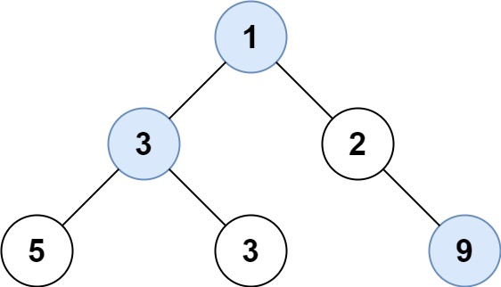

## [515. Find Largest Value in Each Tree Row]((https://leetcode.com/problems/find-largest-value-in-each-tree-row/description/))

Given the root of a binary tree, return an array of the largest value in each
row of the tree (0-indexed).

Ex1:

Input: root = [1,3,2,5,3,null,9]
Output: [1,3,9]

Ex2:
Input: root = [1,2,3]
Output: [1,3]

### Approach

**Breadth-First Search (BFS)**
- We can use BFS to traverse the tree level by level. We will use a queue to store
the nodes at each level.
- For each level, we will find the maximum value and add it to the result array.
- We will repeat this process until we have traversed all levels of the tree.
